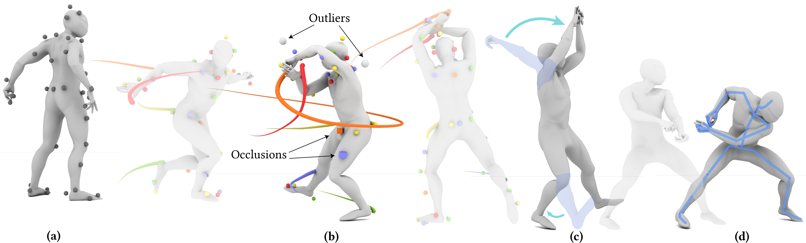

## RoMo: A Robust Solver for Full-body Unlabeled Optical Motion Capture

Optical motion capture (MoCap) is the "gold standard" for accurately capturing full-body motions. To make use of raw MoCap point data, the system labels the points with corresponding body part locations and solves the full-body motions. However, MoCap data often contains mislabeling, occlusion and positional errors, requiring extensive manual correction. To alleviate this burden, we introduce RoMo, an automatic learning-based framework for robustly labeling and solving raw optical motion capture data. In the labeling stage, RoMo employs a divide-and-conquer strategy to break down the complex full-body labeling challenge into manageable subtasks: full-body segmentation and part-specific labeling. To utilize the temporal continuity of markers, RoMo generates marker tracklets using a K-partite graph-based clustering algorithm, where markers serve as nodes and edges are formed based on positional and feature similarities. For motion solving, to prevent error accumulation along the kinematic chain, we introduce a hybrid inverse kinematic solver that utilizes joint positions as intermediate representations and adjusts the template skeleton to match estimated joint rotations. We demonstrate that RoMo achieves high labeling and solving accuracy across multiple metrics and various datasets. Extensive comparisons show that our method outperforms state-of-the-art research methods. On a real dataset, RoMo improves the F1 score of hand labeling from 0.94 to 0.98, and reduces the position error of body motion solving by 25%. Furthermore, RoMo can be applied in scenarios where commercial systems are inadequate.